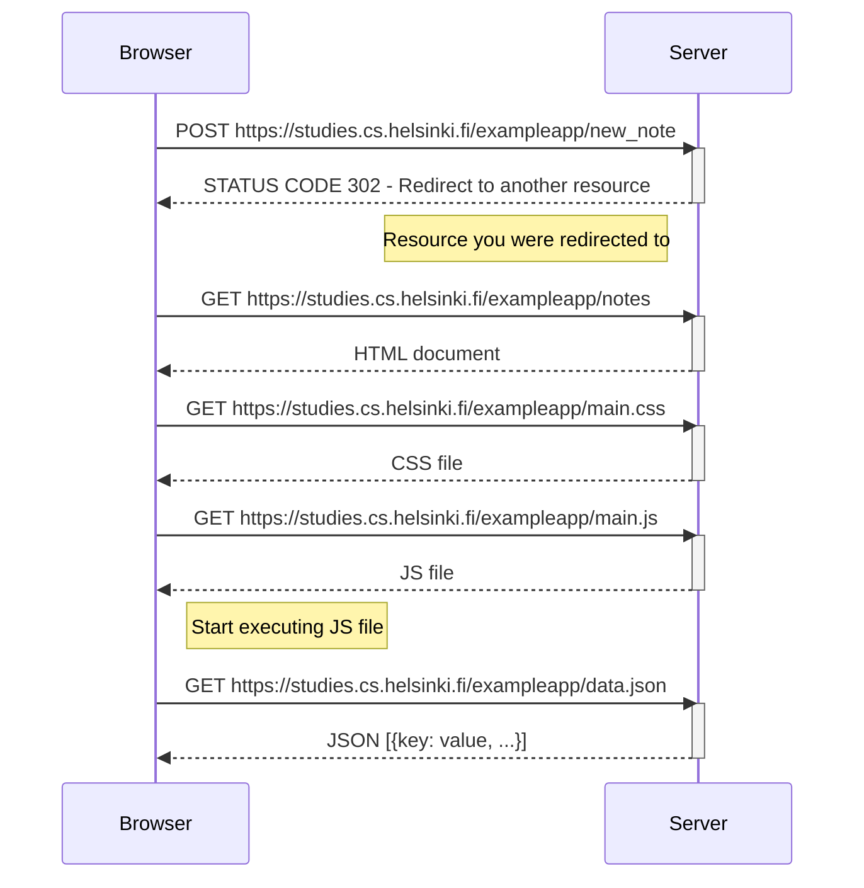

```mermaid
sequenceDiagram
    participant B as Browser
    participant S as Server
    %% new note diagram (No SPA)
    %% It is assumed that the HTML, CSS and JS have already been obtained
    B->>S: POST https://studies.cs.helsinki.fi/exampleapp/new_note
    activate S
    S-->>B: STATUS CODE 302 - Redirect to another resource
    deactivate S
    Note left of S: Resource you were redirected to
    B->>S: GET https://studies.cs.helsinki.fi/exampleapp/notes
    activate S
    S-->>B: HTML document
    deactivate S 
    B->>S: GET https://studies.cs.helsinki.fi/exampleapp/main.css
    activate S
    S-->>B: CSS file
    deactivate S
    B->>S: GET https://studies.cs.helsinki.fi/exampleapp/main.js
    activate S
    S-->>B: JS file
    deactivate S
    Note right of B: Start executing JS file
    B->>S: GET https://studies.cs.helsinki.fi/exampleapp/data.json
    activate S
    S-->>B: JSON [{key: value, ...}]
    deactivate S
```